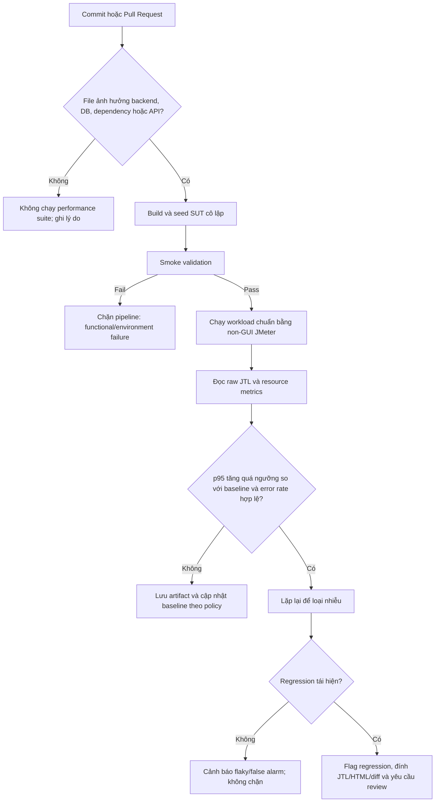

# HW05 — BÁO CÁO KIỂM THỬ HIỆU NĂNG CÓ SỬ DỤNG AI

## 1. Thông tin sinh viên

| Mục | Thông tin |
|---|---|
| Họ tên | **NGUYỄN LÊ QUAN ANH** |
| MSSV | **23127001** |
| Lớp / Nhóm | 23KTPM2 / Nhóm 07 |
| Môn học | CS423 / CSC13003 — Kiểm chứng Phần mềm |
| Bài tập | HW05-AI — Performance Testing |
| Phiên bản đề | **Version 1.0** |
| SUT | EShop backend API local |
| Công cụ | Apache JMeter 5.6.3; htop 3.3.0; OpenAI Codex |
| Thời gian thực thi chính thức | Load: 16/08/2026 14:47:22–14:49:22 UTC; Stress: 15:05:59–15:09:59 UTC; Spike: 15:16:43–15:19:13 UTC; Endurance PENDING |

## 2. Tóm tắt điều hành

Ba scenario chính thức đều không có request lỗi. Load ổn định ở 20 threads;
Stress tăng tuyến tính đến 80 threads mà chưa thấy breaking point. Spike 100
threads làm p95 tăng từ 49 ms ở baseline steady lên 1.497 ms, sau đó recovery
về 56,6 ms. Kết luận maximum stable RPS vẫn chờ Endurance.

| Scenario | Endpoint | Samples | Throughput | p95 | Error rate | Kết luận |
|---|---|---:|---:|---:|---:|---|
| Load | `GET /api/users/me` | 1.940 | 16,796 req/s | 55 ms | 0% | Ổn định ở cấu hình 20 threads; chưa phải hardware threshold |
| Stress | `POST /api/cart` | 54.311 | 226,544 req/s | 16 ms | 0% | Chưa suy giảm tại trần thử nghiệm 80 threads; đây chưa phải hardware threshold |
| Spike | `POST /api/forgot-password` | 2.814 | 18,917 req/s | 1.530 ms | 0% | Spike gây latency degradation rõ rệt nhưng recovery gần baseline |

Endurance threshold: `PENDING_REAL_EXECUTION`.

## 3. Test basis, phạm vi và lý do chọn endpoint

Bài chọn Version 1.0 theo Q&A ngày 11/08/2026: sinh viên chỉ cần hoàn thành
một trong hai version và ghi rõ lựa chọn. Version 1.0 yêu cầu mỗi Load, Stress,
Spike nhắm đúng một nhóm endpoint; ba nhóm được bao phủ đúng một lần.

| Scenario | Nhóm | Feature từng được phân công ở HW02 | Lý do |
|---|---|---|---|
| Load | Read-heavy | FR-04mb | `GET /api/users/me` chỉ đọc một hồ sơ SQLite; JWT là điều kiện truy cập, không phải hành vi được đo. |
| Stress | Transactional | FR-07 | `POST /api/cart` là add-to-cart, ví dụ transactional được nêu trực tiếp trong đề. Backend thêm item vào cart in-memory nên tải tăng dần có thể bộc lộ latency/memory ceiling. |
| Spike | Auth-heavy | FR-03 | `POST /api/forgot-password` thuộc workflow xác thực và cập nhật reset token khi lưu lượng tăng đột ngột. |

Ba feature trên thuộc phạm vi Member 1 trong báo cáo HW02 của sinh viên, nên
không trùng feature được phân công cho thành viên khác ở homework trước.

## 4. Môi trường và cấu hình phần cứng

### 4.1 Software

| Thành phần | Phiên bản/cấu hình |
|---|---|
| Host OS | Windows + WSL2 |
| WSL kernel | 6.6.87.2-microsoft-standard-WSL2 |
| Node.js | 18.19.1 |
| npm | 9.2.0 |
| Java | OpenJDK 17.0.19 |
| JMeter | 5.6.3 |
| htop | 3.3.0 |
| Backend | Node.js + Express 5.2.1 + SQLite |
| Base URL | `http://localhost:3000` |

`npm install` cảnh báo `sqlite3@6.0.1` khai báo Node >=20.17.0, nhưng smoke
test xác nhận native module load và ba endpoint chạy được. SUT không bị chỉnh
sửa hoặc `npm audit fix`.

### 4.2 Hardware thật

| Thành phần | Giá trị |
|---|---|
| Hostname | `DESKTOP-L0U0JQ4` |
| Máy | Dell Vostro 3590; Windows 11 Home Single Language 64-bit |
| CPU vật lý | Intel Core i5-10210U @ 1.60 GHz; 4 cores, 8 logical processors |
| RAM vật lý | 16 GB DDR4, 2667 MT/s, 2/2 slots used |
| WSL CPU nhìn thấy | 2 logical CPU |
| WSL RAM nhìn thấy | 7.7 GiB |
| WSL swap | 4.0 GiB |
| WSL virtual filesystem | 1.007 TB total; 940 GB available tại thời điểm thu evidence |

Evidence: `evidence/hardware/dxdiag.png`, `cpu.png`, `memory.png` và
`wsl_environment.txt`. Hostname `DESKTOP-L0U0JQ4` khớp evidence HW04.

## 5. AI-assisted test design và Human Review

### 5.1 Quy trình cộng tác

1. AI đọc Version 1.0/2.0, policy, source SUT và HW02/HW04.
2. Sinh viên chọn Version 1.0 và yêu cầu tái sử dụng feature không trùng.
3. AI đề xuất mapping, tạo CSV/JMX/runner và smoke-test ở tải cực nhỏ.
4. Sinh viên chịu trách nhiệm chấp nhận endpoint, chạy chính thức và xác minh evidence.

### 5.2 Human Review đã thực hiện trước run chính thức

| Output/giả định ban đầu | Vấn đề | Bản sửa/xử lý |
|---|---|---|
| Gợi ý dùng FR-16 làm endpoint thứ ba | Import là write-heavy, không thể gọi là read-heavy | Dùng FR-04mb `GET /api/users/me`; loại FR-16 khỏi ba scenario chính |
| CSV do AI tạo có dòng rỗng cuối file | JMeter luân phiên đọc record rỗng; smoke Spike sinh 404 giả | Xóa record rỗng; chạy lại cả ba smoke test, 0 lỗi |
| Có thể coi raw smoke metrics là kết quả | Run 3–7 giây không đại diện performance | Chỉ lưu ở `/tmp`, không đưa vào submission |
| `npm audit fix` được npm gợi ý | Có thể thay dependency/SUT | Không chạy; giữ SUT bất biến |
| Assertion FR-03 chỉ kiểm tra `resetToken` tồn tại | Không xác nhận OTP đúng 6 chữ số theo spec | Ghi nhận rõ performance availability khác functional conformance; BUG-FR03-001 đã có evidence HW02, không che giấu hoặc gọi OTP 4 số là đúng |

Sau Stress, human review bác bỏ cách gọi 80 threads là breaking point: đây chỉ
là trần cấu hình của plan. Raw JTL vẫn có 0 lỗi và latency thấp tại trần, nên
chưa có evidence về điểm suy giảm hoặc giới hạn phần cứng.

## 6. Test plan và dữ liệu

| Plan | Default model | CSV riêng | Report view |
|---|---|---|---|
| `23127001_Load_20260816.jmx` | 20 threads; ramp 20 s; 120 s; think 1 s | `profile_data.csv` | View Results Tree |
| `23127001_Stress_20260816.jmx` | 80 threads; ramp 180 s; 240 s; think 200 ms | `cart_data.csv` | Summary Report |
| `23127001_Spike_20260816.jmx` | baseline 5; spike 100 trong 1 s sau 60 s; spike 30 s | `forgot_password_data.csv` | Aggregate Report |

Ba plan dùng connection/response timeout, HTTP status assertion và response
contract assertion. JWT được lấy trước measured run bằng
`scripts/prepare_test_data.js`, nên Load/Stress JTL không bị trộn sample login.

Các report view được giữ khác nhau theo rubric. Run chính thức dùng non-GUI
CLI và sinh HTML dashboard từ raw JTL.

## 7. Task 1 — Kết quả thực thi

### 7.1 Load — FR-04mb profile read

- Lệnh: `./scripts/run_scenario.sh load`
- Timestamp JMeter: 16/08/2026 14:47:22–14:49:22 UTC
- JTL: `results/jtl/23127001_Load_20260816.jtl`
- HTML: `results/html/23127001_Load_20260816/`
- Screenshot: `evidence/load/load_runtime_steady.png` và
  `load_cli_final_summary.png`; JMeter CLI và htop cùng frame.
- Kết quả raw JTL: 1.940 samples, 0 failure, 0% error, average 24,713 ms,
  p95 55 ms, p99 66 ms, max 72 ms và throughput 16,796 req/s trên cửa sổ
  sample 115,501 giây.
- Resource tại ảnh steady: process `node server.js` khoảng 7,3% CPU, 0,9% MEM
  và RES 69.498 KiB; đây là một snapshot, không được diễn giải là peak.
- Kết luận: workload Load mặc định ổn định trên profile này nhưng chưa chứng
  minh giới hạn phần cứng. Threshold chỉ kết luận sau Stress/Endurance.

### 7.2 Stress — FR-07 add to cart

- Lệnh: `./scripts/run_scenario.sh stress`
- Timestamp JMeter: 16/08/2026 15:05:59–15:09:59 UTC
- JTL: `results/jtl/23127001_Stress_20260816.jtl`
- HTML: `results/html/23127001_Stress_20260816/`
- Screenshot: `evidence/stress/stress_runtime_ramp.png`,
  `stress_runtime_peak.png` và `stress_cli_final_summary.png`; terminal JMeter
  và htop xuất hiện cùng frame.
- Kết quả raw JTL: 54.311 samples, 0 failure, 0% error, average 5,575 ms,
  p50 4 ms, p90 12 ms, p95 16 ms, p99 28 ms, max 88 ms và throughput
  226,544 req/s trên cửa sổ sample 239,737 giây.
- Tải tăng từ 1 đến 80 active threads trong 180 giây. Interval 30 giây cuối
  đạt 389,1 req/s, average 4 ms, max 41 ms và 0 lỗi.
- Breaking/degradation point: **chưa quan sát thấy trong phạm vi đã thử**. Mức
  80 threads là ceiling cấu hình, không phải hardware threshold.
- Resource evidence: ảnh ramp ở 13 active threads cho thấy Node khoảng 35,9%
  CPU và RES 84.852 KiB. Ảnh tại 80 active threads cho thấy Node RES khoảng
  106 MiB; hai logical CPU WSL lần lượt khoảng 44,3% và 47,3%. Sau khi kết
  thúc, Node RES khoảng 73.792 KiB. Đây là các snapshot, và CPU tổng của WSL
  còn bao gồm JMeter nên không được diễn giải thành peak CPU riêng của backend.
- `userCarts` có tăng theo write workload, nhưng RES giảm sau run và latency
  không suy giảm; run bốn phút này chưa đủ để kết luận memory leak hoặc memory
  ceiling. Endurance sẽ kiểm tra khả năng ổn định lâu hơn.

### 7.3 Spike — FR-03 forgot password

- Lệnh: `./scripts/run_scenario.sh spike`
- Timestamp JMeter: 16/08/2026 15:16:43–15:19:13 UTC
- JTL: `results/jtl/23127001_Spike_20260816.jtl`
- HTML: `results/html/23127001_Spike_20260816/`
- Screenshot: `evidence/spike/spike_runtime_baseline_17s.png`,
  `spike_runtime_baseline_47s.png`, `spike_runtime_peak.png` và
  `spike_recovery_cli_final_summary.png`.
- Kết quả toàn raw JTL: 2.814 samples, 0 failure, 0% error, average 989,965 ms,
  p95 1.530 ms, p99 3.414,99 ms, max 9.403 ms và throughput 18,917 req/s trên
  cửa sổ sample 148,752 giây.
- So sánh pha dùng timestamp bắt đầu sample so với JMeter test start. Guard
  band loại ramp/queue-drain: baseline steady 5–50 s, spike 60–90 s và
  recovery steady 100–145 s. Script và output nằm tại
  `scripts/summarize_spike_phases.py` và `results/analysis/spike-phases.*`.

| Pha steady | Samples | Throughput theo window | Average | p95 | p99 | Max | Lỗi |
|---|---:|---:|---:|---:|---:|---:|---:|
| Baseline 5–50 s | 200 | 4,444 req/s | 28,1 ms | 49 ms | 66 ms | 102 ms | 0 |
| Spike 60–90 s | 2.114 | 70,467 req/s | 1.163,789 ms | 1.497 ms | 1.703,87 ms | 8.539 ms | 0 |
| Recovery 100–145 s | 195 | 4,333 req/s | 26,862 ms | 56,6 ms | 111,78 ms | 138 ms | 0 |

- Spike làm p95 tăng khoảng 30,6 lần so với baseline steady. Recovery p95 chỉ
  cao hơn baseline 7,6 ms, nên dịch vụ phục hồi trong cửa sổ quan sát.
- Resource snapshot: Node RES khoảng 66.084 KiB ở giây 17, 82.284 KiB ở giây
  47, khoảng 102 MiB lúc 105 active users và 79.160 KiB sau run. Snapshot cuối
  cho thấy hai CPU WSL khoảng 9,5%/9,9%; không đủ để tuyên bố peak backend CPU.
- Source thực hiện `SELECT` rồi `UPDATE users` qua SQLite cho mỗi request.
  Latency tăng do tranh chấp/queue ghi là giả thuyết phù hợp source và shape,
  nhưng cần profiling DB để xác nhận nguyên nhân gốc.

Spike sử dụng email/password hợp lệ và không gọi `/api/login`, nên không kích
hoạt cơ chế khóa do ba lần đăng nhập sai. Không có bước reset lockout giả tạo.

### 7.4 Endurance 10–15 phút

Load plan được chạy lại bằng CLI với duration mặc định 900 giây và output riêng:

```bash
./scripts/run_scenario.sh endurance
```

- JTL/HTML/screenshot: `PENDING_REAL_EXECUTION`
- Maximum stable RPS: `PENDING_REAL_EXECUTION`
- p95 ổn định: `PENDING_REAL_EXECUTION`
- Memory ceiling: `PENDING_REAL_EXECUTION`
- Tiêu chí “stable” được dùng: `PENDING_DEFINE_FROM_LECTURE_OR_EVIDENCE`

## 8. Task 2 — AI analysis và misinterpretation hunt

### 8.1 Dữ liệu đưa cho AI

Chỉ sử dụng ba raw JTL thật, summary sinh bởi `scripts/summarize_jtl.py` và
resource evidence. Prompt/output nguyên văn phải nằm trong AI Audit Report.

### 8.2 Misinterpretation

| AI claim | Giá trị đúng từ raw JTL | Cách kiểm tra | Nguyên nhân sai |
|---|---:|---|---|
| PENDING_AI_ANALYSIS | PENDING_RAW_JTL | PENDING | PENDING |

Không tạo sẵn lỗi diễn giải giả. Chỉ điền khi AI thực sự đọc sai metric.

### 8.3 Đề xuất tối ưu

| Đề xuất của AI | Feasible/Hallucinated | Evidence source | Lý do |
|---|---|---|---|
| PENDING_AI_ANALYSIS | PENDING | PENDING_SOURCE_REVIEW | PENDING |

## 9. Task 3 — Continuous Performance Testing proposal



Mô hình chỉ chạy suite khi commit tác động backend, schema/query database,
dependency hoặc API contract; các thay đổi tài liệu thuần túy được bỏ qua. p95
được so với baseline trên cùng profile máy và cùng dataset. Cần ít nhất một
lần rerun trước khi chặn để giảm false alarm do scheduler, warm-up hoặc tiến
trình nền. Baseline không tự cập nhật trên một run regression.

Trade-off:

- Chạy mọi commit tăng chi phí và thời gian phản hồi; selective trigger có thể
  bỏ sót ảnh hưởng gián tiếp.
- Ngưỡng quá chặt gây false alarm; quá rộng che regression nhỏ tích lũy.
- Local runner rẻ nhưng nhiễu; runner cô lập ổn định hơn nhưng tốn hạ tầng.
- Rerun giảm false positive nhưng tăng thời gian và tài nguyên CI.

## 10. Bug/performance issue

`PENDING_REAL_EXECUTION`. Chỉ tạo GitHub Issue khi tái hiện bằng run thật và có
screenshot. Bug functional cũ từ HW02 không được tính lại như bug HW05 mới.

## 11. Agent Skill

Skill: `agent-skill/build-jmeter-performance-evidence/`.

Skill hướng dẫn đọc test basis, giữ SUT bất biến, thiết kế scenario/data,
smoke-test, thu raw evidence, phân tích JTL và audit submission. Script audit
được chạy trên chính suite này.

- Kết quả validation: `PENDING_FINAL_SKILL_AUDIT`
- Video/timeline demo skill trên một endpoint group: `PENDING_STUDENT_VIDEO`

## 12. AI Critique — 200–300 từ

`PENDING_AFTER_REAL_AI_ANALYSIS`. Đoạn cuối phải dựa trên lỗi AI thực sự đã
xảy ra, gồm CSV blank record và ít nhất một misinterpretation từ Task 2; không
được bịa một claim mà AI chưa từng đưa ra.

## 13. Kết luận

`PENDING_REAL_EXECUTION`.

## 14. Tự đánh giá

| Tiêu chí | Tối đa theo đề | Tự đánh giá |
|---|---:|---:|
| Load testing | 20 | PENDING |
| Stress testing | 20 | PENDING |
| Spike testing | 20 | PENDING |
| AI analysis + misinterpretation | 10 | PENDING |
| Continuous Performance Testing | 10 | PENDING |
| Agent Skill | 10 | PENDING |
| **Tổng số học của rubric** | **90** | **PENDING** |

Đề ghi hàng Total là 100 dù sáu tiêu chí cộng thành 90. Báo cáo không tự thêm
tiêu chí; chờ xác nhận TA trước khi đặt `<SelfAssessedGrade>` trong tên ZIP.
