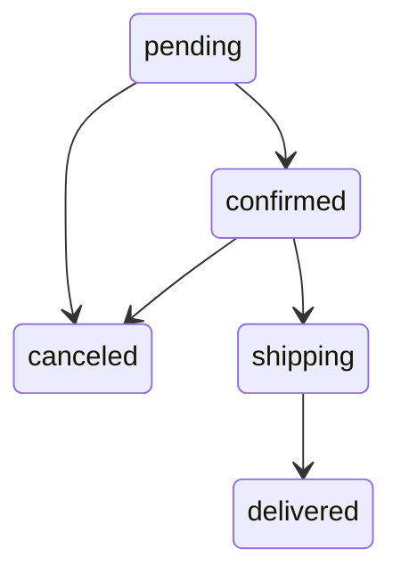

# HW06 — Test basis and test design

## Scope

| Pool | Primary API | Feature | Test focus |
|---|---|---|---|
| A | `POST /api/login` | FR-02 | input partitions, lockout, JWT and response contract |
| B | `PUT /api/orders/:id/cancel` | FR-10 | ownership/IDOR and user cancellation state transitions |
| C | `PUT /api/admin/orders/:id/status` | FR-18 / FR-10 | role access control and complete admin state machine |

The test oracle is the SRS (`README.md`, version 2.0) and `api_specification.md`, not the current implementation. The source was inspected only to plan safe setup and identify hypotheses. Every request must contain `X-Student-Id: 23127001`.

## Contracts and preconditions

| API | Request / precondition | Expected contract |
|---|---|---|
| Login | JSON `email`, `password`; a seeded user exists | Valid credentials: `200`, JSON object with non-empty JWT `token` and `user`; no plaintext password in response. Invalid credentials: suitable `401` without account detail. Failed-attempt counter increases by exactly one; lock after three consecutive failures for 30 s; a valid login resets it. |
| Cancel order | Valid user JWT and an order owned by that user | `pending`/`confirmed` → `canceled` succeeds. `shipping`, `delivered`, `canceled` cannot be user-canceled. Other users must receive denial/not-found without state change. |
| Admin status | Valid admin JWT and an existing order | Only admin may invoke it. Valid edges are `pending→confirmed|canceled`, `confirmed→shipping|canceled`, `shipping→delivered`; `delivered` and `canceled` are final. Success response is JSON with a message; invalid transition is a client error and preserves state. |

## Security traceability

| Requirement | Applicable tests |
|---|---|
| SEC-02 JWT required | B/C: missing, malformed, expired/invalid token |
| SEC-03 Admin role required | C: ordinary-user JWT must be rejected |
| SEC-05 Parameterized database access | A: SQL-like strings as credential inputs; no authentication or server error |
| SEC-01 password handling | A: successful response must not disclose password; source review is supporting evidence only |
| FR-10 final states and roles | B/C: all allowed and forbidden transitions |

## State model

No edge leaves `delivered` or `canceled`. A user may cancel only `pending` and `confirmed`; admin transitions follow the diagram.

## Bug hypotheses requiring real execution

1. Login counter may increment by two and lock for 180 seconds, contrary to FR-02.
2. User cancellation may accept `shipping`, contrary to FR-10.
3. Admin status may accept an ordinary user token and may permit `canceled→delivered`, contrary to SEC-03/FR-10.
4. A successful login may return a user object including `password`, contrary to SEC-01.

These are hypotheses, not bug reports, until Newman evidence is captured.
